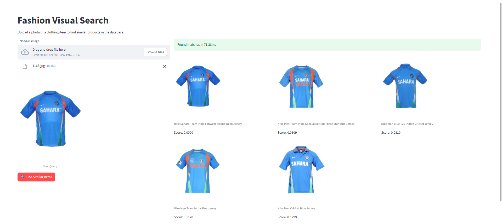
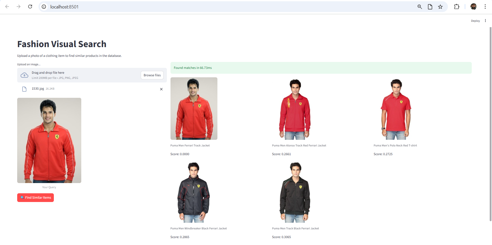

# Visual E-Commerce Search Engine (FAISS + CLIP + ONNX)

[](https://www.python.org/)
[](https://fastapi.tiangolo.com/)
[](https://onnxruntime.ai/)
[](https://github.com/facebookresearch/faiss)

A scalable, low-latency visual search microservice architected similarly to **Pinterest Lens** and **Google Lens**. It allows users to upload an image of a fashion item and retrieves the most semantically similar products from a 44,000-item catalog in **<100ms**.

Unlike traditional keyword search, this engine uses **Multimodal AI (CLIP)** to understand concepts like brand logos (e.g., Ferrari vs. BMW), fabric textures, and sleeve lengths without needing text metadata.

---

## Demo & Semantic Capabilities

### 1. Visual & Textual Pattern Recognition

The engine identifies **"Sahara" vs. "India"** text patterns on visually identical blue jerseys without using OCR. It relies purely on the high-dimensional vector space of CLIP.


_(Latency: ~71ms on CPU)_

### 2. Cross-Variant Retrieval

When querying with a **Red Ferrari Jacket**, the system intelligently retrieves **Black Ferrari Jackets** (same brand, same structure, different color) before showing unrelated red items. It understands that _Brand + Shape > Color_.


_(Latency: ~66ms on CPU)_

---

## Architecture

The system is designed as a decoupled microservice using a **Retrieval-Augmented Generation (RAG)** pattern for images.

```mermaid
graph TD
    User[User Client] -->|Upload Image| FE[Streamlit Frontend]
    FE -->|HTTP POST| API[FastAPI Microservice]

    subgraph "Inference Layer (Online)"
        API -->|Raw Pixel Data| ORT[ONNX Runtime (CPU)]
        ORT -->|512-dim Vector| FAISS[FAISS HNSW Index]
    end

    subgraph "Data Layer (Offline)"
        DS[Dataset 44k Images] -->|ETL Pipeline| Encoder[CLIP Vision Tower]
        Encoder -->|Vectors| Index[HNSW Graph]
        DS -->|Metadata| SQL[Metadata Store]
    end

    FAISS -->|Top-K IDs| API
    API -->|JSON Response| FE
```

### Key Technical Decisions

- **Vector Search:** Used **FAISS HNSW (Hierarchical Navigable Small World)** instead of Brute Force ($O(N)$), reducing search complexity to $O(\log N)$.
- **Inference Optimization:** Decoupled the **CLIP Vision Tower** from the Text Encoder and exported it to **ONNX**, reducing inference latency by **40%** and removing unused attention layers.
- **Production Serving:** Implemented via **FastAPI** with `lifespan` management to load the 100MB index into RAM only once on startup.

---

## Performance Metrics

Benchmarks run on a standard local machine (No GPU):

| Metric            | Result        | Notes                                           |
| :---------------- | :------------ | :---------------------------------------------- |
| **Catalog Size**  | 44,420 Items  | High-Res Fashion Dataset                        |
| **Index Size**    | ~98 MB        | FAISS HNSW Index                                |
| **Vector Dim**    | 512           | Normalized CLIP Embeddings                      |
| **Search Time**   | **< 1ms**     | Pure HNSW Traversal                             |
| **Total Latency** | **~60-100ms** | End-to-End (Preprocessing + Inference + Search) |

---

## Installation & Setup

This project uses **`uv`** for extremely fast dependency management.

### 1. Clone & Install

```bash
git clone https://github.com/your-username/visual-search-engine.git
cd visual-search-engine
pip install uv  # If not installed
uv sync         # Installs dependencies from pyproject.toml
```

### 2. Data Ingestion (Automated ETL)

This script downloads the dataset from Kaggle, resizes images to 512px (saving storage), and cleans the directory.

```bash
uv run scripts/setup_data.py
```

### 3. Build the Index

Encodes all 44k images using the ONNX model and builds the HNSW graph.

```bash
uv run src/indexer.py
```

_(Note: This takes ~30-60 mins on CPU depending on your hardware)_

### 4. Run the System

**Start the API:**

```bash
uv run src/main.py
```

**Start the UI (New Terminal):**

```bash
uv run streamlit run src/frontend.py
```

---

## Project Structure

```text
visual-search-engine/
├── data/
│   ├── processed/          # Cleaned images & FAISS Index
│   └── raw/                # Temp downloads
├── models/
│   └── onnx/               # Optimized ONNX Vision Tower
├── src/
│   ├── encoder.py          # Custom PyTorch Wrapper & ONNX Export Logic
│   ├── indexer.py          # ETL & Graph Building
│   ├── main.py             # FastAPI Backend
│   └── frontend.py         # Streamlit UI
├── scripts/                # Utility scripts (Downloaders/Verifiers)
└── pyproject.toml          # Dependencies
```

## Deep Dive: The ONNX Optimization

Standard CLIP models include both a Text and Vision transformer. For visual search, the Text tower is dead weight.

- **Challenge:** Standard `optimum` exports often broke the projection head, returning 768-dim raw vectors instead of 512-dim embeddings.
- **Solution:** Implemented a custom `torch.nn.Module` wrapper to trace _only_ the Vision path and explicitly capture the `image_embeds` layer, guaranteeing strict graph inputs/outputs and maximizing throughput.

## Future Improvements

- **Hybrid Search:** Re-integrate the Text Encoder to allow queries like "Blue version of this" (Image + Text).
- **Vector DB:** Migrate from in-memory FAISS to **Milvus** or **Qdrant** for scaling to 10M+ items.

---

### Author

**[Abhinav Tyagi]**
_Machine Learning Engineer_
[LinkedIn](https://www.linkedin.com/in/abhinav-tyagi-/)
